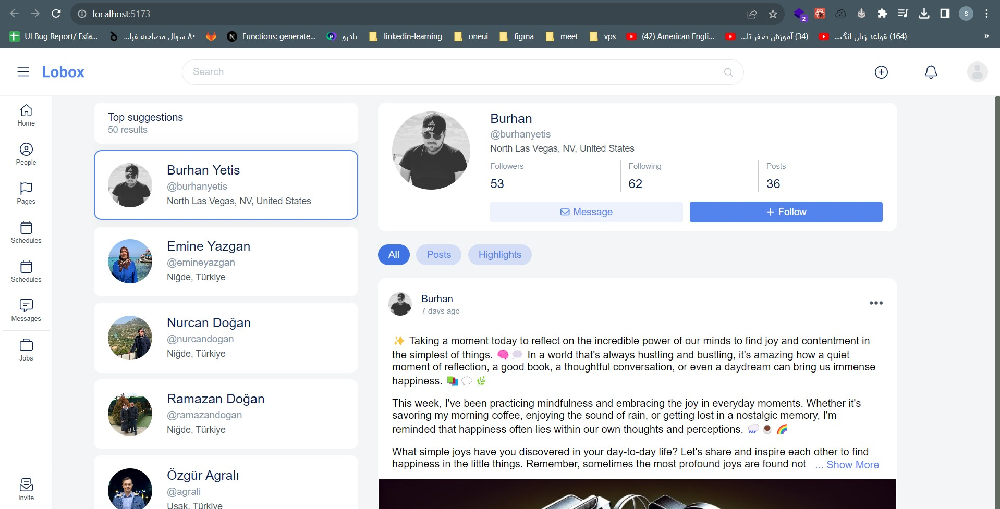
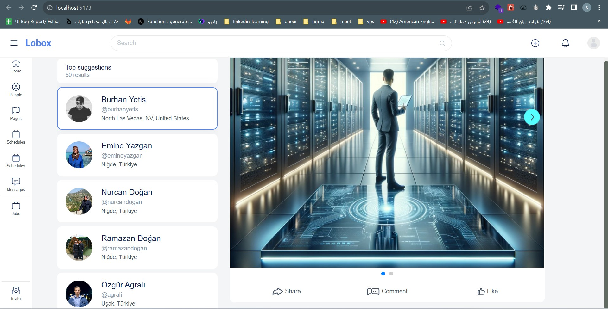
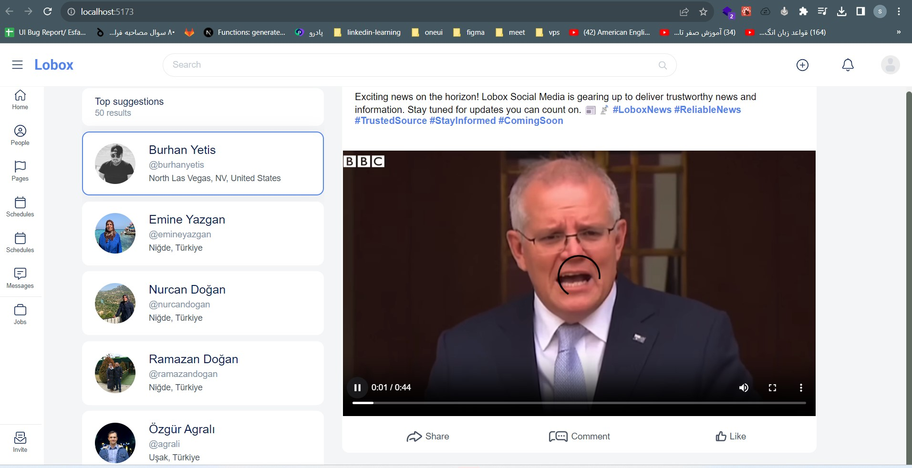
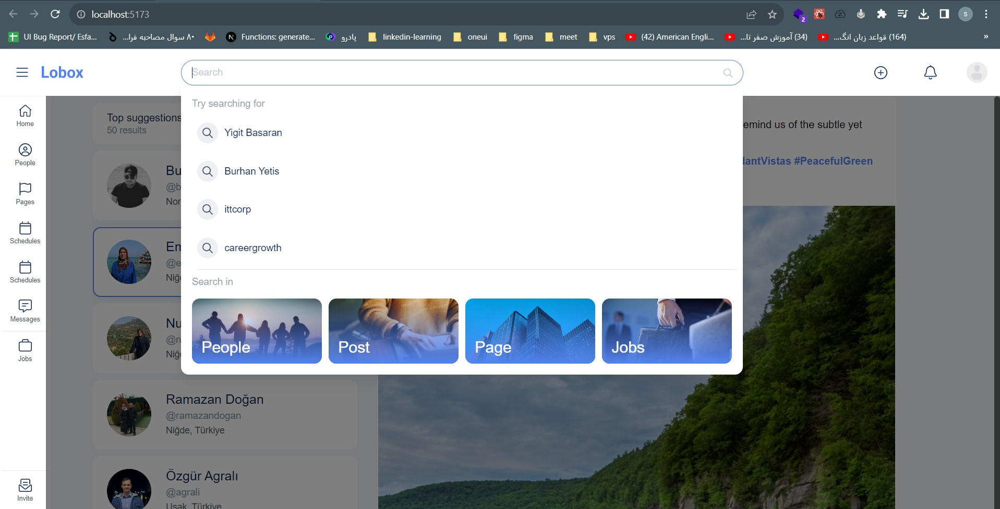

# Lobox React App

## Overview
This project is a comprehensive example for building React applications with Vite and TypeScript. It includes a development demo environment with Msw, Axios, and React Query for data fetching, vitest and jest for testing, and BEM-structured SCSS files. (This project was inspired by the search section of the lobox.com social network)

  
  
  
  

To get started with the development demo environment:

<ol><li>Clone the repository.</li><li>Install dependencies using <code>npm install</code>.</li><li>Run the development server with <code>npm run dev</code>.</li><li>Explore the app and the mock data provided by MSW.</li></ol>

## Features

* Development demo environment with MSW for mocking API responses
* Data fetching with Axios and React Query for efficient data management
* BEM-structured SCSS files for organized and maintainable styles
* Vitest and Jest for comprehensive unit and integration testing
* Well-structured components, including Image Slider, Card, Button, Tag, Expandable Text, and Video Slider
* Integration of Singleton pattern and mixins for reusable code and improved development flexibility

## Table of Contents

- [Development Demo Environment with MSW](#development-demo-environment-with-msw)
- [Building the React App with TypeScript and Vite](#building-the-react-app-with-typescript-and-vite)
- [Building Test with Vitest and Jest](#building-test-with-vitest-and-jest)
- [Building Components](#building-components)
- [Fetching Data with Axios and React Query](#fetching-data-with-axios-and-react-query)
- [Building SCSS Files with BEM Methodology](#building-scss-files-with-bem-methodology)

## Development Demo Environment with MSW

Mock Service Worker (MSW) is an API mocking library that enables developers to create client-agnostic mocks. This allows for efficient testing and development, as mocks can be reused across various frameworks, tools, and environments. The demo environment is set up to provide a seamless experience for developers working on the project.

To get started with the development demo environment:

1. Clone the repository.
2. Install dependencies using `npm install`.
3. Run the development server with `npm run dev`.
4. Explore the app and the mock data provided by MSW.

## Building SCSS Files with BEM Methodology

Styles are organized using the BEM (Block, Element, Modifier) methodology, which promotes maintainability and reusability of CSS code.

## Building Test with Vitest and Jest

Vitest and Jest are JavaScript testing frameworks used for unit and integration testing in this project. They provide comprehensive testing capabilities to ensure the app's functionality and stability.

## Building Components

Various components have been implemented in this project to enhance the user interface. Notable components include:

* Image Slider
* Card
* Button
* Tag
* Expandable Text
* Video Slider

Explore the `src/components` directory to find and customize these components for your needs.

## Fetching Data with Axios and React Query

Data fetching is handled using Axios for making HTTP requests and React Query for managing the state of the fetched data. This combination ensures efficient and optimized data retrieval. Explore the `src/utils/api` directory for APIs.

## Singleton Pattern and Mixins

This project demonstrates the use of the Singleton pattern and mixins for reusable code and improved development flexibility.

## Connect with Me

Feel free to connect with me on LinkedIn!

